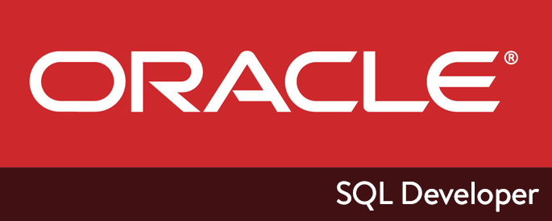
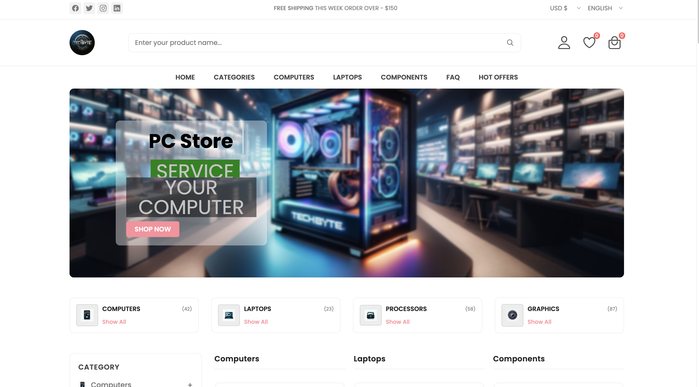

# Database project - Computer store

## Final database project

### Full application of a store selling computers and computer components, with a Frontend written in JavaScript, a Backend in PHP, and a PL/SQL database

# TechByte

## Introduction

Welcome to the GitHub repository of the TechByte computer store project. This store is a modern e-commerce platform, offering a wide selection of computer products, including laptops, desktop computers, and components and accessories.

## Project Structure

The repository is organized into several directories that are responsible for different parts of the web application and contain necessary files for the operation of the store. Here is a detailed description of each directory and file:

### Structure of the ComputerStore Project

The ComputerStore project contains several directories and files related to documentation, database design, and the application frontend.

### .github/workflows
- static.yml # Configuration file for GitHub Actions

### backend
### app
(Path to the main application logic, models, controllers)
### bootstrap
(Path to the application bootstrap files)
### config
- app.php
- auth.php
- cache.php
- database.php
- filesystems.php
- hashing.php
- logging.php
- mail.php
- oracle.php
- queue.php
- services.php
- session.php
(Configuration files for the application)

### database
(Path to database migrations and seeds)

### public
(Path to publicly accessible files)

### resources
(Path to view templates and language files)

### routes
(Path to route definitions)

### scripts
(Path to custom scripts)

### storage
(Path to storage files like logs, compiled views)

### tests
(Path to test files)

### vendor
(Path to Composer dependencies)

### docs
### jsDoc
- database-storage-and-limitation.docx
- project-description-v1.docx
- project-description-v2.docx
- suggestions-sopics.docx
- README.md # Project documentation

### entity-relationship-diagram
- DB-Diagram.pdf
- ERD_v3.pdf
- ERD_v3.png
- ERD-project-base-drawio.pdf
- ERD-Projekt-v2-drawio.pdf
- ERD-VERSION1.png
- ERD-VERSION2.png
- ERD-VERSION3.png
- ERD.pgerd
- README.md # ER diagram documentation

### frontend
### assets
(Path to resources like graphics, CSS, etc.)
### components
(Path to reusable components)
### computers
(Possible path to computer-specific components or pages)
### laptops
- account.html
- cart.html
- checkout.html
- CNAME # CNAME configuration file for the custom domain
- components.html
- computers.html
- contact.html
- dashboard.html
- faq.html
- favorite.html
- index.html # Main page of the store
- laptops.html
- login.html
- privacy.html
- sales.html

## plsql-oracle19c
### python-codes
- clear.sql
- delete.sql
- export_of_data.sql
- export.sql
- procedures.sql
(PL/SQL scripts for database management)

### Project root files
- .env.example
- .env
- .gitignore
- CONTRIBUTING.md
- LICENSE
- README.md # This file with instructions

### .github/workflows

Directory containing CI/CD system definitions for the project, including automatic testing and deployment of changes.

### docs

Directory with project documentation, including API specifications and user manuals.

### backend

Directory with PHP scripts responsible for the backend logic, data handling, session management, and interaction with the database.

### entity-relationship-diagram

Directory containing files documenting the Entity-Relationship Diagram (ERD) for the store database.

### frontend

Directory containing the frontend application, including HTML files, CSS, JavaScript, and other assets used to create an engaging user interface.

### plsql-oracle19c

Directory containing PL/SQL scripts for database management, including stored procedures, triggers, and data export/import scripts.

### Project root files

- Configuration and environment setup files.
- Contribution guidelines and license information.
- Main README file with project instructions.

## Getting started

Instructions on how to start working with this repository and launching the store can be found in the [README.md](https://github.com/dawidolko/Database-Project-ComputerStore/blob/main/README.md) file.

## License

The project is distributed under the MIT license. See the [LICENSE](https://github.com/dawidolko/Database-Project-ComputerStore/blob/main/LICENSE) file for more information.

## Collaborators

List of people involved in the development of the project:

- [dawidolko](https://github.com/dawidolko)
- [piotrsmola](https://github.com/piotrsmola)

## Contribution

If you want to contribute to this project, please see our contribution guidelines in the [CONTRIBUTING.md](https://github.com/dawidolko/Database-Project-ComputerStore/blob/main/CONTRIBUTING.md) file.

---

Feel free to explore the repository and provide feedback or contribute to the project. For any questions or issues, please contact the collaborators.
